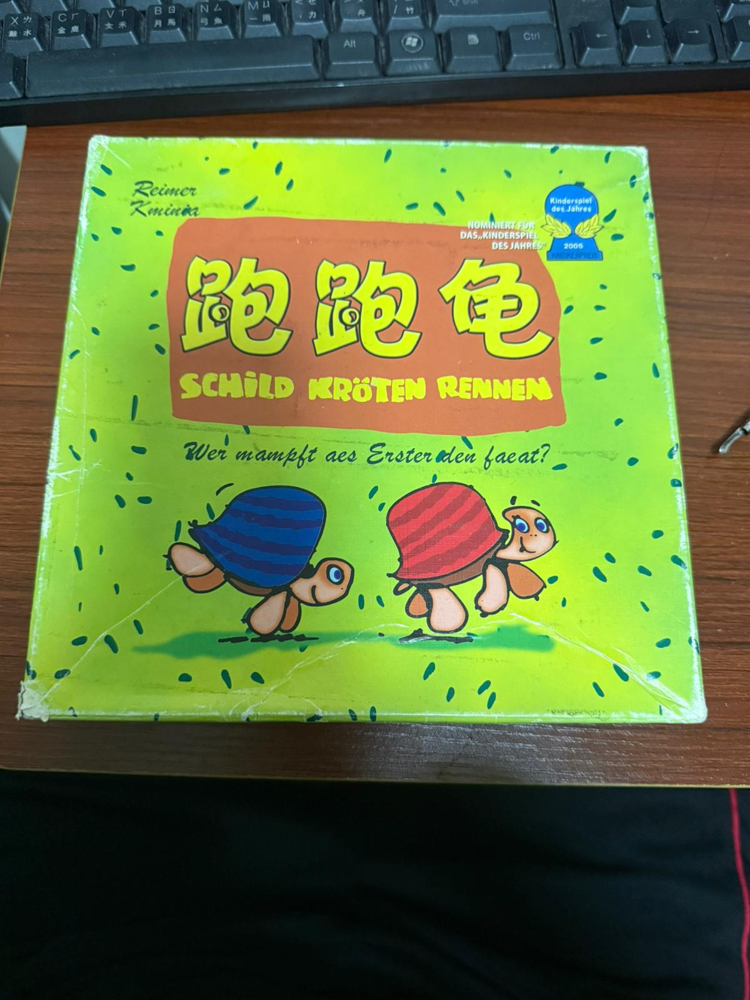
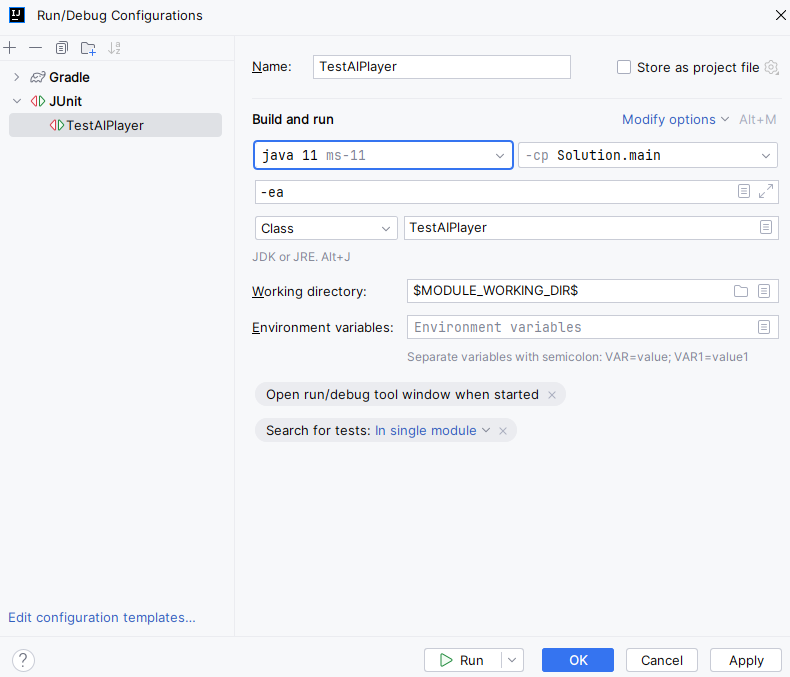

# COMP2046 Programming Assignment 3 - The Great Turtle Race

## 2025-26 Semester 1

* Designed by: [Dr. Kevin Wang](mailto:kevinw@comp.hkbu.edu.hk)
* Q & A: [Discord](https://discordapp.com/channels/1004554070083776672/1004554070083776678)
* Assignment Website: [GitHub](https://github.com/khwang0/COMP2046-2526PA3)
* Due: 
  * UAT: No UAT
  * Programming Due: 23:59 on 1/12/2025 (Monday)
* Download the demo program: [here](demo.jar)
* Download everything from the assignment: [here](https://github.com/khwang0/COMP2046-2526PA3/archive/refs/heads/master.zip)

> To run the demo program, type the following in your terminal:
> 
> ```sh
> java -jar demo.jar
> ```
> Or, to run the program with 3 players:
> ```sh
> java -jar demo.jar 3
> ```
>



> Expected working time: < 8 hours, excluding time spent reading the assignment and learning the lecture materials.

# Learning outcome

Students are expected to apply the concepts of polymorphism, abstract classes, interfaces, anonymous classes/lambda expressions, and generics to construct the game.

> In this assignment you are **required** to use List/ArrayList. You can use other data structures from java.util. 
> You are not allowed to use java.lang.reflect to alter the visibility of any class members.

# Introduction

Based on the context of Assignment 2, we continue working on the game The Great Turtle Race (Schild Kröten Rennen, 跑跑龟). In this assignment, we add more features:
- Adding rainbow-color cards (+1, -1, arrow, double arrow).
- Introducing Human Player and AI Player.

We understand that you may not have completed Assignment 2 yet. As a result, it is not required that your Assignment 3 program be fully functioning. You only need to complete the required classes in this assignment. You can start this assignment as an entirely new project. We will provide some test classes to help you validate the correctness of your code.

Some methods are labeled as completed or provided. Please don't make any changes to those methods. You are not supposed to modify them. You can add your own methods if you want to. However, you are not allowed to introduce any additional class variables (fields) or additional classes. Whenever possible, please refer to the constant variables (final) defined in the program.

## Explanation of the game **The Great Turtle Race**

The best description of the game in English is given here: https://boardgamegeek.com/thread/76810/schildkroten-rennen-draft-rules-in-english

Video tutorials of the game are available: 
- Cantonese: https://youtu.be/AM4v1prCzTk
- English: https://youtu.be/K8P7djudUTA
- Putonghua: https://www.youtube.com/watch?v=Cve8dsEGxZs

Please spend some time understanding the game before you start the assignment.

---

# Explanation about the assignment

You are given the skeleton code. Complete all methods in the assignment with respect to the instructions stated in the Java file.

### `ArrowPlayCard` :clipboard:

This extends the `PlayCard` class.
- It has a constructor with one parameter: a Gameboard.
- The color of the card is to be determined. It triggers the current player (reachable from `Gameboard.getCurrentPlayer()`) to choose the color of a turtle among all turtles standing in the last column.
- The `getSteps()` method always returns 1.
- The `toString()` method should return only "Arrow PlayCard".
- The type of the card is `Gameboard.ARROW_CARD`.
- Noted: `ArrowPlayCard` is not a type of `RainbowPlayCard`.

### `DoubleArrowPlayCard` :clipboard:

This extends the `ArrowPlayCard` class.
- It has a constructor with one parameter: a Gameboard.
- Similar to `ArrowPlayCard`, the color of the card is to be determined.
- The `getSteps()` method always returns 2.
- The `toString()` method should return only "Double-Arrow PlayCard".

> Test `ArrowPlayCard` and `DoubleArrowPlayCard` with [TestArrowPlayCard.java](TestArrowPlayCard.java)

### `RainbowPlayCard` :clipboard:

This extends the `PlayCard` class. 
- It has a constructor with two parameters: a String steps, and a Gameboard. The parameter steps can be either "+1" or "-1" to indicate a rainbow +1 card or a rainbow -1 card. 
- The color of the card is to be determined. It triggers the current player (reachable from `Gameboard.getCurrentPlayer()`) to choose a turtle color.
- The type of the card is `Gameboard.RAINBOW_CARD`.
- The `toString()` method should return "Rainbow{+1}" or "Rainbow{-1}" accordingly.
- The `getSteps()` method should return 1 or -1 accordingly.
- Note: `RainbowPlayCard` is not a subtype of `ArrowPlayCard`.

> Test `RainbowPlayCard` with [TestRainbowPlayCard.java](TestRainbowPlayCard.java)  

### `Player` :heavy_check_mark:

You are given a full implementation of the abstract class `Player`. Do not modify it. You need to complete the two subclasses: `HumanPlayer` and `AIPlayer`.

There are two abstract methods: `chooseCardToPlay` and `choosePrompt`

- `chooseCardToPlay`: Depends on the type of player; it has different implementations. This method is responsible for picking a card from the player's hand to play, either by asking the human player to input a choice or by letting the AI player make a decision automatically. 
- `choosePrompt`: This method is used when the player has to make a choice among multiple options. For example, when the player plays a rainbow +1 card, he/she chooses which color turtle to move forward. In the case of an arrow/double-arrow card, the player will need to choose which turtle to move if more than one turtles are standing in the last column together. Again, a human player will be asked to input a choice, while an AI player will make the decision automatically.

In both methods, you need to make sure the choice is valid. That is, the card from `chooseCardToPlay` must be in the player's hand. The option from `choosePrompt` must be one of the given options.

### `HumanPlayer` :clipboard:

- It has a constructor with two String parameters: name and color.
- In both abstract methods, you need to prompt the user to input a choice. To play a card, the human player should enter the option number (starting from 1). In `choosePrompt`, the human player should enter the color of the turtle directly (e.g., "red", "green"). Invalid input should be handled by re-prompting the user to enter again.
- ~~We slightly modify the `toString` method so that it returns the player's name and color followed by the cards in his/her hand. For example:~~

~~Alice(green) has the following cards:~~

~~1: PlayCard{green,+1}~~

~~2: PlayCard{red,-1}~~

> Updated: The requirement of `toString` is removed. You don't need to modify it.

> Test your class with [TestHumanPlayer.java](TestHumanPlayer.java)  

### `AIPlayer` :clipboard:

- It has a constructor with two parameters. The first parameter is a String color; the second parameter is a `List<Turtle>` turtleList. The second parameter provides the AI player with references to all turtles in the game. There should be five turtles in total.
- The name of the first AI player is "AI - 1", the second AI player is "AI - 2", and so on.
- It has a private static serial number variable to keep track of the number of AI players created so far.
- It has an `AIAlgorithm` field called `algorithm` that determines which card to play. 
   - If no algorithm is set, the AI player simply plays the first card in its hand (index 0). 
- In `chooseCardToPlay`, the AI player will use the algorithm to decide which card to play.
- In `choosePrompt`, the AI player will do the following:
  - If the AI is asked to choose a color when a RAINBOW +1 is played, it will choose its own color.
  - If the AI is asked to choose a color when a RAINBOW -1 is played, it will choose any color that will not cause its own turtle to move backward. If all colors will cause its own turtle to move backward (i.e., all turtles are stacked together and its own turtle is on the top), it will choose the lowest turtle from the stack. 

Example, if the AI player controls green:
```txt
R       G
B   Y   P
```
The AI player will choose either Red/Blue/Yellow when it plays RAINBOW -1.

```txt
     R
     G
     B
     Y
     P
```
In this case the AI player will choose Red since Red is the only option that will not cause Green to move backward.

```txt
    G
    R
    B
    Y
    P
```
In this case the AI player will choose Purple since Purple is the lowest turtle in the stack.

> Test your class with [TestAIPlayer.java](TestAIPlayer.java). You don't need to finish your algorithm class to test this class.

### `AIAlgorithm` interface :heavy_check_mark:

This interface is given to you. You don't need to make any changes to it. There is only one method called `chooseCardIndex` which, depending on the player's color, the `PlayCards` in the player's hand, and the list of turtles in the game, decides which card to play.

### RandomAlgorithm class :clipboard:

This class implements the AIAlgorithm interface and provides a random strategy for the AI player to choose a card. Basically, it has no strategy at all: it just randomly picks a number from 0 to 4.

There is no constructor other than the default constructor. It has no fields and no other methods.

### Anonymous/lambda Algorithm class :clipboard:

You will find the code in the [Gameboard.java](Gameboard.java) that marked with one TODO. In which, it leaves the code here

```java
AIPlayer aiPlayer = (AIPlayer)players[2];
//set a special algorithm for this AI player
//TODO
//   aiPlayer.setAlgorithm( ... );
```

Complete the code to set a special algorithm for this AI player. The algorithm should be implemented using either an **anonymous class** OR a **lambda expression**. The strategy of this algorithm is as follows:
- Play any card (no need to be random), except an ordinary "-1" of its own color. 

To elaborate, consider the following situation:

```txt
R       G
B   Y   P
```

If the AI player controls Green, it can play any card except `PlayCard{green, -1}`. It can also play `PlayCard{purple, -1}` or `Rainbow -1`. 

If the AI player only has `PlayCard{green, -1}` in its hand, it has no choice but to play that card.

> We don't provide a test class for this part. You need to test it yourself. The algorithm is simple. As long as everything compiles, it should be fine.

### `Shuffler` :clipboard:

By referring the following usage in Gameboard.java, write the class [Shuffler.java](Shuffler.java) with generics.

```java
//Usage 1
String[] myColor = COLORS.clone();
Shuffler<String> colorShuffler = new Shuffler<>();
colorShuffler.shuffle(myColor);
//This will shuffle the array myColor randomly
```

```java
//Usage 2
Shuffler<Player> shuffler = new Shuffler<>();
shuffler.shuffle(players);
//This will shuffle the array players randomly
```

```java
//Usage 3
public void shufflePlayCards() {
    if (playCards == null) {
        System.out.println("No play cards available to shuffle.");
        return;
    }
    Shuffler<PlayCard> shuffler = new Shuffler<>();
    shuffler.shuffle(playCards);
}
//This will shuffle the array playCards randomly
```

To help you develop the class, we provide the Assignment 2 solution for the shufflePlayCards method here:

```java
public void shufflePlayCards() {
    if (playCards == null) {
        System.out.println("No play cards available to shuffle.");
        return;
    }
    for (int i = 0; i < playCards.length; i++) {
        int randomIndex;
        randomIndex = ThreadLocalRandom.current().nextInt(0, playCards.length);
        PlayCard temp = playCards[i];
        playCards[i] = playCards[randomIndex];
        playCards[randomIndex] = temp;
    }
    //lastly, examine any null in the middle and push them forward.
    for (int i = 0; i < playCards.length; i++) {
        //if this is an empty spot, find a non-null card at the back to swap with it.
        if (playCards[i] == null) {
            for (int j = i + 1; j < playCards.length; j++)
                if (playCards[j] != null) {
                    playCards[i] = playCards[j];
                    playCards[j] = null;
                    break;
                }
            if (playCards[i] == null) //cannot swap, giveup.
                break;
        }
    }
}
```

> Test your class with [TestShuffler.java](TestShuffler.java)

## Clarifications

Please read the latest clarifications on Discord. We will tag them with #PA3C.

1. In AIPlayer.chooseCardToPlay, the algorithm of AI determines which card to play. It is possible that an AIPlayer will play a "-1" card of its own color if the algorithm decides so. This is acceptable for algorithm RandomAlgorithm.
2. However, when you implement the anonymous/lambda algorithm, you need to make sure that the AIPlayer will not play a "-1" card of its own color unless there is no other choice.
3. RainbowPlayCard and ArrowPlayCard are not related. That is, RainbowPlayCard does not extend ArrowPlayCard.
4. (Updated 28/11/2025) In HumanPlayer toString, the requirement is removed. You don't need to modify it. The numbering of cards should start from 0 instead of 1. 


---

## Memory concept

In this assignment, we still use a two-dimensional array to store references to turtles in the game. However, in addition to that, we also use a `List<Turtle> turtleList` in [Gameboard.java](Gameboard.java) to store all turtles in the game. This is to facilitate other classes (e.g., AIPlayer) to access all turtles easily. 

Let's say your Assignment 2 `moveTurtle` does not work and you cannot fully understand how the 2D array works in memory. You can still finish this assignment without any problem. Just ignore the 2D array and use the list `turtleList` to access all turtles in the game.


## Test classes

Like your PA1 and PA2, we provide some test classes to help you validate the correctness of your code. Once you have finished your class, you can use the corresponding test class to check if it works properly.


1. Open the file `TestClass.java`
2. Click on the word `@Test`.
 
 

3. Click the red bulb and select Add **JUnit5** to classpath.
 
 

4. Click the arrow on the left of `public class TestClass` at line 17 and select `Run Tests`.
 
 

5. You should see the following screen if there isn't any problem.
 
   

6. Or you will see some errors if your code does not perform as it is supposed to. For example, in the figure below, the test case `testReadValidInput` is not working properly.
 
 

#### If the above does not work, please try the following steps:

1. From the menu bar click `Run` > `Edit Configurations...`
2. Click the + icon on the top left corner and select `JUnit`.
3. Type the test class name in the Class field directly and click OK.



# Understanding the Assignment Test (UAT)

No UAT for this assignment.

---

# Submission 
For submission, upload all Java files to Moodle.  

Please be reminded that both the Late Penalty Rule and the Penalty for Plagiarism are applied strictly to all submissions of this course (including this assignment).   

## Late Penalty Rule

We empathize with students who have difficulties in meeting deadlines. However, we also need to be fair to other students who have submitted their work on time. Therefore, the following late penalty rule will be applied to all submissions of this course (including this assignment).

- Late submission without prior application of due date extension: 10%–50%.
- Late submission with prior approval of due date extension: 0%.

## Plagiarism

Plagiarism is a serious offense and can be easily detected. Please don't share your code with your classmates, even if they threaten your friendship. If they do not have the ability to produce something that compiles, they are unlikely to be able to change your code enough to avoid detection. For the first instance of plagiarism, regardless of whether you shared your code or copied code from others, you will receive a score of 0 with an additional 5-mark penalty. If you commit plagiarism twice, your case will be presented to the exam board and you will receive an F directly.

> # Terms about generative AI
> You are not allowed to use any generative AI in this assignment.
> The reason is straightforward: if you use generative AI, you will be unable to practise your coding skills. We would like you to get familiar with the syntax and logic of Java programming.
> We will examine your code using detection software as well as by manual inspection. Using generative AI tools may cause you to fail the assignment.

## Marking Scheme 
This assignment is worth 14% of the course mark. There are several elements in the marking scheme: 
* 20% - Compiling against the corresponding test case file (no need to compile and run the whole program).
* 20% - The program as a whole runs (without modifying other parts of Gameboard.java except the TODO).
* 40% - Passing the test cases we provide.
* 20% - Passing the test cases that we design additionally.
* -20% - If your program cannot be compiled using the Java 11 compiler, even if it works in a higher version of Java.

Please note that submitting a program that cannot be compiled will result in a very low mark. 

For correctness, we will test your program with a set of test cases. The test cases will be similar to the sample program. All test cases will be released after the submission deadline.  
 
## Interview 
Should the teaching team see fit, students may be requested to attend an interview to explain their program. Failure to attend such an interview or to demonstrate a good understanding of your own program may result in mark deduction.


